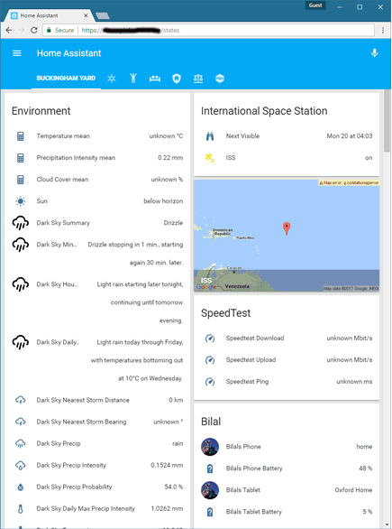

[TOC]

# Introduction
Repo for my current Home Assistant Configuration. This is ofcourse a work in progress. Use as inspiration for yours or send me a message if you see any glaring issues. 

# UI Screenshots

Notes about some of the installed components that are split among multiple files.

### Device Tracking
* 
* 
* 

### Alarm Clock
* input_slider.yaml
* input_boolean.yaml
* scripts.yaml
* sensor.yaml

### ZoneMinder
* 
* 
* 

### Security System
* 
* 
* 

# References
List of references where i have gleamed my info. I will do my best to keep this up to date.

 - [BRUH Automation YouTube Channel](https://www.youtube.com/channel/UCLecVrux63S6aYiErxdiy4w/featured) 
 - [Home Assistant Documentation](https://home-assistant.io/)